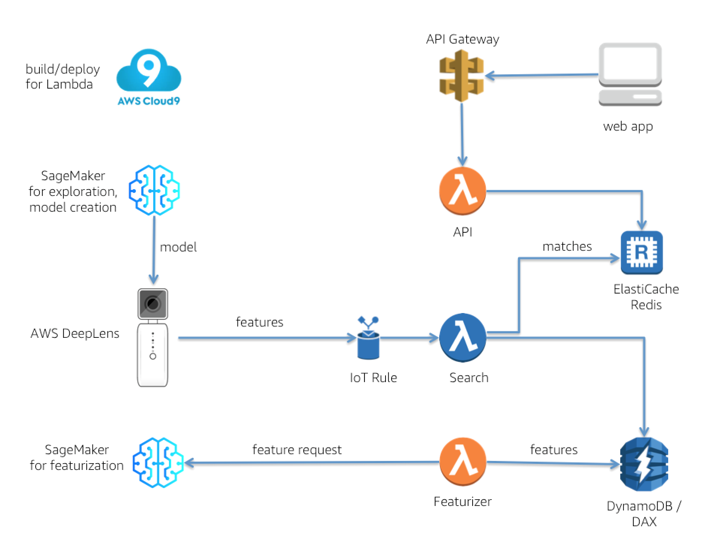

# Visual Search with Amazon SageMaker and AWS DeepLens


This repository provides resources for implementing a visual search engine. Visual search is the central component of an interface where instead of asking for something by voice or text, you *show* what you are looking for. For an in-depth discussion of how visual search works and this project, see the related blog post series on the AWS Machine Learning Blog:

-  [Visual search on AWS—Part 1: Engine implementation with Amazon SageMaker](https://aws.amazon.com/blogs/machine-learning/visual-search-on-aws-part-1-engine-implementation-with-amazon-sagemaker/)
-  [Visual search on AWS—Part 2: Deployment with AWS DeepLens](https://aws.amazon.com/blogs/machine-learning/visual-search-on-aws-part-2-deploying-a-visual-search-model-with-aws-deeplens/)

Briefly, here’s how the system works. When shown a real world, physical item, an AWS DeepLens device generates a feature vector representing that item. The feature vector generated by the AWS DeepLens device is sent to the AWS cloud using the AWS IoT service. An AWS IoT Rule is used to direct the incoming feature vector from the device to a cloud-based AWS Lambda function, which then uses that feature vector to search for visually similar items in an index of reference item feature vectors. This index is created using SageMaker's k-Nearest Neighbors (k-NN) algorithm. The search Lambda function returns the top visually similar reference item matches, which are then consumed by a web app via a separate API Lambda function fronted by Amazon API Gateway, as shown in the following architecture diagram.  



##
## How to Deploy1
In order to deploy this project, you'll need to spin up multiple pieces of infrastructure.  Before doing so, please go through the Jupyter notebook in the notebooks directory to gain a deeper understanding of what is happening under the hood:  [**Visual Search notebook**](./notebooks/visual-search-feature-generation.ipynb).  The notebook also prepares the model you'll deploy to the AWS DeepLens device.

The following instructions cover setup of the minimum number of pieces needed to view search results from feature vectors generated by AWS DeepLens.  The instructions assume you have a basic familiarity with AWS in general and AWS DeepLens in particular.  

1. **AWS DeepLens setup**:  You'll need to create an AWS DeepLens project with (1) the model, and (2) a Lambda function to run on the AWS DeepLens device.
     - **Model**:  Before proceeding, make sure you have run the Jupyter notebook [**Visual Search**](./notebooks/visual-search-feature-generation.ipynb). In the directory where you ran the notebook, locate the model files ```featurizer-v1-0000.params``` and ```featurizer-v1-symbol.json```. Place the model files in a S3 bucket with a name of the form ```deeplens-sagemaker-<your_name>```.  Click the **Models** link in the left pane of the DeepLens console, then click **Import Model** and select **Externally trained model.**  Enter the S3 path and model name.
     - **Lambda function**:  From the DeepLens directory of this repository, copy the Lambda function code.  Create a new Lambda function using the blueprint ```greengrass-hello-world``` and paste the copied code into the code editor to completely replace the code in ```greengrassHelloWorld.py```.  Make sure that you save, and then publish the function code by choosing **Publish new version** from the **Actions** menu. 
     - **DeepLens project**:  In the DeepLens console, click **Create new project**, then select **Create new blank project**.  Given the project a name, then add the model and Lambda function you created above.  
     
2.  **Data Store setup**:  This project makes use of two separate data stores.
      - **Amazon ElastiCache Redis**:  using the ElastiCache console, create a one-node Redis cluster.  Under **Advanced Redis settings**, make sure the default VPC and default security group are selected.  For testing purposes, you can set the instance type and size to ```cache.t2.micro```.  Make a note of the Primary Endpoint URL after creation.  
      - **Amazon DynamoDB**:  using the DynamoDB console, create a table named ```VisualSearchFeatures```.  Set the table's Partition key to be a String named **id**. Either now or later you can populate the DynamoDB table with reference item metadata (product titles, image URLs etc.), as discussed below in the **Populating the Metadata** section of these instructions.
     
3.  **API and Search Lambda function setup**:  To create and deploy these Lambda functions, it is recommended (but not necessary) to use the AWS Cloud9 IDE for ease of use, and its built-in management capabilities for serverless applications using AWS Serverless Application Model (SAM).
      - **VPC note**:  both Lambda functions must be associated with a VPC because they need to communicate with ElastiCache Redis.  If you are using SAM either with Cloud9 or separately, see the file ```template.yaml``` in this repository for an example of VPC configuration.  Be sure the security group you specify for the Lambda functions is the same as the one for the ElastiCache Redis cluster.  For simplicity of test setup, the default security group is suggested (though not for a production environment).  
      - **PrivateLink**:  to ensure that the Lambda functions created below can communicate with the SageMaker endpoint in a secure manner, create a PrivateLink resource, specifying the default VPC, default subnets, and default security groups. For details, see https://aws.amazon.com/blogs/machine-learning/secure-prediction-calls-in-amazon-sagemaker-with-aws-privatelink/.  
      - **API Lambda function**:  From the API directory of this repository, copy the Lambda function code.  Create a new Lambda function with a blank template; in the **Network** section of the **Configuration** tab of the Lambda console, make sure that the default VPC, default subnet(s), and default security group are selected. Then paste the copied code into the code editor. In the constants section of the code, change the Redis endpoint URL to the Primary Endpoint URL of your ElastiCache Redis.  Do this by changing the value of the constant ```redis_hostname```.
      
      - **Search Lambda function:**  From the Search directory of this repository, copy the Lambda function code.  Create a new Lambda function with a blank template.  Similarly to the API function, check the **Network** section of the configuration. Then paste the copied code into the code editor. In the constants section of the code, change the SageMaker endpoint name and Redis endpoint URL to the Primary Endpoint URL of your ElastiCache Redis.  Do this by changing the values of the constants ```endpoint_name``` and ```redis_hostname```, respectively.  Add an IoT trigger to the Lambda function configuration, with an IoT Rule of the form:
      ```
      SELECT * FROM '<your_DeepLens_device_MQTT_topic>'
      ```
      
4.  **Amazon API Gateway setup**:  using the API Gateway console, create an API.  The API only needs one method, a POST method with a resource of the form ```/matches```, which will invoke the API Lambda function you created above.  Be sure to enable CORS.  After the API is published, note the API's URL by clicking **Stages**, clicking the Stage name, then copying the **Invoke URL**.

5.  **Front end / web app setup**:  Either download or clone this repository, then in the code replace the API URL with the URL of the API you created in the previous step.  To do this, go to the file ```/app/services/appConfig.js```, then change the line shown below by replacing the angle brackets and URL inside them with your Invoke URL:
```
  .constant('ENV', '<your_API_Gateway_Invoke_URL>');
```
Open the web app code in a text editor that has a captive web server, such as the Brackets editor.  Highlight the index.html file, then launch the web server, which will open a browser window.  In the web app UI, click through the **Visual Search** link. After you add reference item data to DynamoDB (see **Populating the Metadata** section below), you should see matches populating the UI after a few seconds.


## Populating the Metadata

In order to view test results in the web app, you'll need to populate the DynamoDB table created above with some reference item data.  To extract reference item metadata, please refer to the “Extract the Metadata” section of the Jupyter notebook [**Visual Search**](./notebooks/visual-search-feature-generation.ipynb). The code there writes the metadata out in JSON format to a file. 

Some sample test data is supplied in the test directory of this repository, including a very small sample and a larger sample of Amazon.com product metadata, including image URLs.  There also is a Python 3 script named ```metadata-to-ddb.py``` for importing the data to DynamoDB .  Execute the script with the following command in a directory that contains both the script and test data:

```
python3 ./metadata_to_ddb.py
```


# Licenses & Contributing

The contents of this repository are licensed under the [Apache 2.0 License](./LICENSE). 
If you are interested in contributing to this project, please see the [Contributing Guidelines](./contributing/CONTRIBUTING.md).  In connection with contributing, also review the [Code of Conduct](./contributing/CODE_OF_CONDUCT.md).  

The larger dataset of Amazon.com product images referenced herein was collected by the authors of the paper, J. McAuley et al (2015), “Image-based recommendations on styles and substitutes,” SIGIR, https://arxiv.org/abs/1506.04757. 

